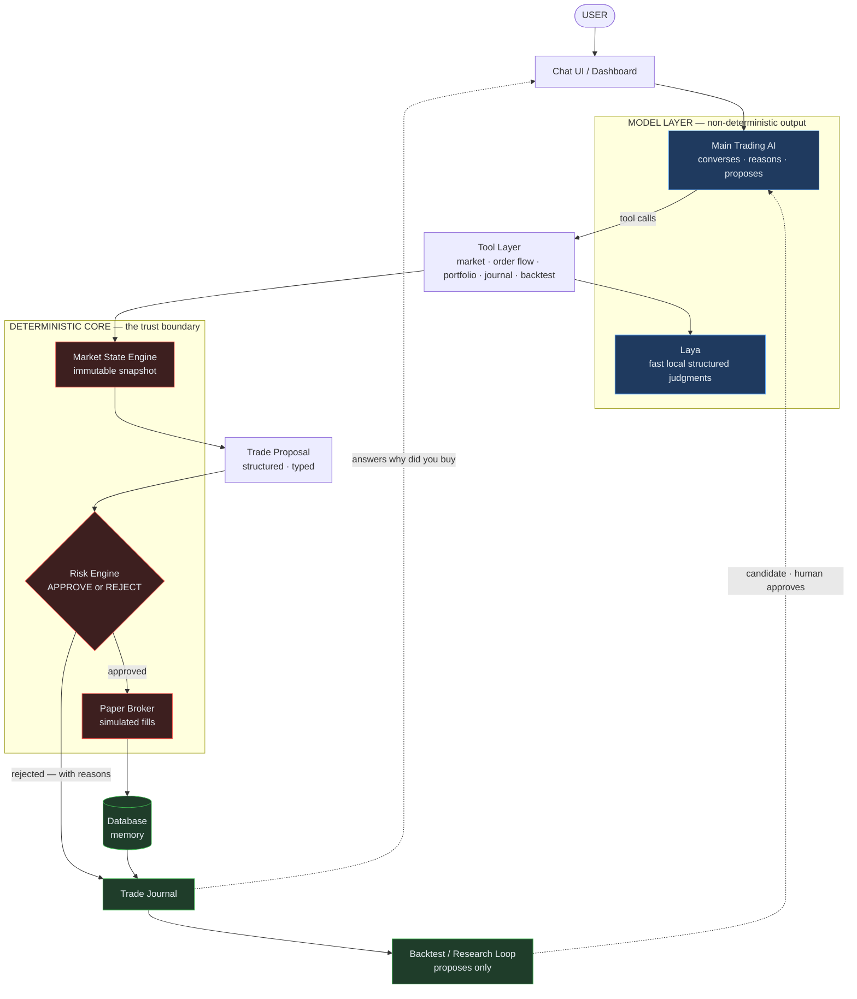
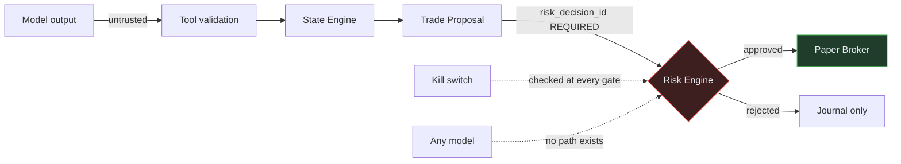
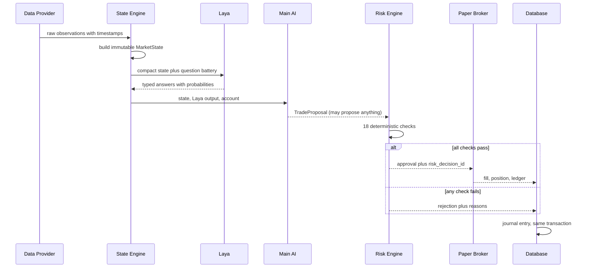

# 03 - System Architecture

## Purpose

Define how components connect and — more importantly — where the trust boundaries are.

## The principle

> **MODELS ADVISE. CODE DECIDES.**

Two models produce output (Main AI, Laya). Neither can widen a limit, approve a trade,
or stop the kill switch. Between "a model suggested something" and "an order exists" there
is always deterministic code.

## Layers

```
┌─ USER ──────────────────────────────────────────────────────┐
│  Chat UI / Dashboard                                        │
└──────────────────────────┬──────────────────────────────────┘
                           ▼
┌─ MODEL LAYER (non-deterministic output) ────────────────────┐
│  Main Trading AI ── conversational, reasons, proposes        │
│  Laya ─────────── fast local structured judgments           │
└──────────────────────────┬──────────────────────────────────┘
                           ▼
┌─ TOOL LAYER (thin, typed, validated) ───────────────────────┐
│  market · order flow · portfolio · Laya · journal · backtest│
└──────────────────────────┬──────────────────────────────────┘
                           ▼
              TRADE PROPOSAL (structured dataclass)
                           ▼
┌─ DETERMINISTIC CORE (the trust boundary) ──────────────────┐
│  Market State Engine   → immutable snapshot                 │
│  Risk Engine           → APPROVE / REJECT + reasons        │
│  Paper Broker          → simulated fills                    │
└──────────────────────────┬──────────────────────────────────┘
                           ▼
┌─ PERSISTENCE ──────────────────────────────────────────────┐
│  Database → Trade Journal → Backtester → Research Loop      │
└─────────────────────────────────────────────────────────────┘
```

## Diagrams



Blue is model output — untrusted. Red is the trust boundary. Green is memory. Nothing a
model produces crosses the red line without deterministic approval.

### The trust boundaries



### One decision, end to end



The proposal carries a `decision_id` that appears in **every** row it produces — so
"why did you buy ETH?" is one indexed lookup rather than a reconstruction.

## Trust boundaries — the important part

| # | Boundary | Rule | Enforced by |
|---|---|---|---|
| 1 | Model → Tool | Tools validate all arguments. A tool never trusts model input. | Tool layer |
| 2 | Tool → State | Only the Market State Engine writes market state. Tools do not compute features. | `market/state.py` |
| 3 | Proposal → Risk | **No order reaches the broker without a risk verdict.** | `risk/engine.py` |
| 4 | Risk → Broker | Broker accepts only an approved proposal with a `risk_decision_id`. | `trading/broker.py` |
| 5 | Any → Kill switch | Nothing but the user can engage it. No model path clears it. | `risk/emergency.py` |
| 6 | Research → Production | A candidate strategy/model never self-promotes. | Approval gate |

**Boundary 3 is the load-bearing one.** If it can be bypassed, the safety model is fiction.

## Replaceability

Every external dependency sits behind an interface. The rest of the system must not import
provider modules directly.

| Interface | Implementations (initial) | Document |
|---|---|---|
| `LLMProvider` | `OpenAICompatibleProvider` (LM Studio, DeepSeek, OpenAI, Gemini-compat), `MockProvider` | [[04 - Main AI]] |
| `DecisionEngine` | `LayaDecisionEngine`, `MockDecisionEngine` | [[05 - Laya]] |
| `MarketDataProvider` | `BinanceProvider` (provisional), `MockProvider` | [[06 - Market Data]] |
| `Broker` | `PaperBroker` only | [[10 - Paper Trading]] |

Test rule: a module that imports `binance`, `openai`, or `laya` at top level outside its
adapter module is a defect.

## Data flow — one decision, end to end

1. **Collect.** `MarketDataProvider` returns raw observations, each timestamped.
2. **Compute.** `MarketStateEngine` produces an immutable `MarketState` snapshot. Pure function
   of (inputs, as-of timestamp). No LLM.
3. **Decide (fast).** `DecisionEngine` scores a fixed question battery on the compact state.
   Returns typed values + probabilities.
4. **Decide (deep).** Main AI reasons over the state, Laya output, account, and journal.
   Emits a `TradeProposal` or a `HOLD`.
5. **Gate.** `RiskEngine.evaluate(proposal)` → `RiskDecision(approved, reasons)`.
6. **Execute.** If approved and mode permits, `PaperBroker` places a simulated order.
7. **Record.** Every step writes an audit event, a decision row, and a journal entry carrying
   one `decision_id`.

Step 7 is not optional. A trade that is not recorded is treated as a bug, not a loss.

## Ordering and concurrency

- The autonomous loop is **single-threaded per symbol**; one in-flight decision per symbol
  to prevent duplicate entries from overlapping cycles.
- Tool calls are bounded per turn (max rounds) so a confused model cannot loop forever.
- Database writes from the loop are serialized; reads may be concurrent (SQLite WAL).
- The kill switch is checked at every gate: before proposing, before risk, before execution.
  Engagement is immediate and does not wait for a loop iteration to finish.

## Error policy

| Failure | Behaviour |
|---|---|
| Market data missing/stale | No trade. Proposal blocked. |
| Decision engine down | No trade. Fall back to "no edge signal". |
| Main AI down | No autonomous trade. Chat explains. |
| Database unavailable | No autonomous execution. Trading halts. |
| Risk engine unavailable | **No trade, ever.** |
| Model output malformed | Rejected by tool validation. No trade. |

Rationale in [[21 - Testing]] and [[09 - Risk Engine]].

---

[[00 - Home]] · [[04 - Main AI]] · [[05 - Laya]] · [[06 - Market Data]] · [[09 - Risk Engine]]

## See also

- [[20 - Security]] — the safety model in full
- [[17 - Database]] — persistence and the decision trail
- [[26 - Decisions]] — why these boundaries