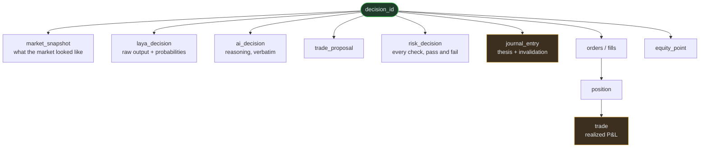

# 12 - Trade Journal

## Purpose

Make every trade explainable **from stored evidence**, not reconstructed narrative. This is
the system's memory, and the answer to "why did you make your last five trades?"

## The non-negotiable rule

> Reasoning is captured **at decision time**. It is never written or edited afterwards.

Reconstructing "why" after seeing the outcome is not memory — it is a story. A model asked
later why it traded will produce a *plausible* justification regardless of what actually
drove the decision. That is exactly the failure this journal exists to prevent.

Therefore: Laya's raw output and the Main AI's stated reasoning are **persisted verbatim**
in the same transaction as the decision. If it was not stored then, it does not exist.

## Diagram



Everything hangs off one id. Nothing is reconstructed.

## Entry lifecycle

Created when a proposal is made; amended when the trade closes.

**On open:**

| Field | Source |
|---|---|
| `decision_id` | minted here; threads every row |
| timestamp | |
| symbol, action, price, quantity | |
| `market_state` | the exact `FeatureSet` used |
| `laya` | raw Laya output verbatim |
| `space_bunny_summary` | model's reasoning verbatim |
| `strategy_id` + version | |
| `model_id`, `laya_version` | |
| `risk_result` + reasons | |
| `thesis`, `invalidation` | from the proposal |

**On close:** `exit_price`, `realized_pnl`, `holding_seconds`, `fees`, `slippage`,
`result` (WIN/LOSS/FLAT), `exit_reason`.

## Traceability

One `decision_id` links: journal entry, market snapshot, Laya output, AI decision, trade
proposal, risk decision, orders, fills, position, trade, and the equity-curve point.

```
decision_id ─┬─ market_snapshot
             ├─ laya_decision
             ├─ ai_decision
             ├─ trade_proposal
             ├─ risk_decision
             ├─ journal_entry
             ├─ orders / fills
             ├─ position → trade
             └─ equity_point
```

This is why `decision_id` is a first-class column, not a JSON blob.

## Answering questions about past trades

`"Why did you buy ETH on 3rd May?"` is answered by **reading stored rows**:

1. Journal entry for that `decision_id`.
2. The `FeatureSet` at that moment.
3. Laya's raw answers with probabilities.
4. The model's reasoning, as written then.
5. The risk verdict.
6. The realised outcome.

The model summarises these rows. It does not re-derive them, and it must state the outcome
including losses. If a field was not stored, the answer says so — "the reasoning for that
trade was not recorded" is a valid and better answer than a plausible fabrication.

## Storage

`trade_journal` table (see `database/schema.sql` in `trading-ai/`). Written in the same
transaction as the decision so a partial write cannot produce an entry with missing
reasoning.

Model reasoning may be long prose; it is stored as-is. No truncation of the decision
context.

## Retention

Nothing is deleted. Journal rows are the training corpus ([[16 - Self Improvement]]) and
the audit trail. Database growth is managed by retention policy on *raw API responses*,
never on decisions or journal entries.

## Testing

- Journal entry created for every proposal, including `HOLD` decisions that were rejected.
- Stored reasoning is byte-identical to what was passed in.
- Amend-on-close populates every close field.
- `decision_id` joins resolve across all tables.
- A decision with no journal entry is a test failure, not a warning.
- Historical reasoning cannot be edited after creation (attempt raises).

---

[[17 - Database]] · [[18 - API and Tools]] · [[11 - Portfolio and Positions]] · [[16 - Self Improvement]]

## See also

- [[10 - Paper Trading]] — what produces the trade being journalled
- [[20 - Security]] — audit requirements
- [[25 - Research Log]] — where measured outcomes are analysed