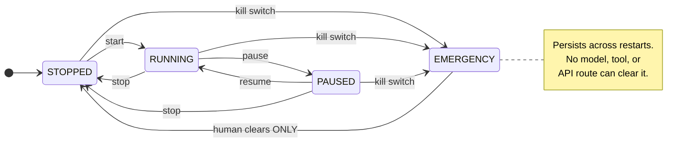

# 15 - Autonomous Trading

## Purpose

A supervised loop that watches markets, uses Laya as a cheap filter, escalates interesting
events to the Main AI, and places **paper** orders through the risk engine.

## Defaults

- **Disabled.** `AUTONOMOUS_TRADING=false`.
- **Paper only.** Cannot execute real orders; no such code path exists.
- **Kill switch engaged by default on startup** — require explicit user action to begin.

## States

```
        STOPPED ◄─── stop / kill switch ───┐
           │                              │
        STARTING                          │
           │                              │
        RUNNING ─── pause ──► PAUSED ──────┘
           │                   │
           └───── resume ──────┘
        EMERGENCY_STOP  (sticky; human clear only)
```

`EMERGENCY_STOP` is distinct: it **persists across restarts** and only the user can clear it.

## Diagram



## Loop

```
1. read configured symbols
2. fetch data                ── fail? → halt, no trade
3. validate freshness         ── stale? → no trade
4. build MarketState          (deterministic)
5. run Laya battery           ── down? → no trade
6. Laya says "interesting"?
      no  → record the filter decision, done
      yes ↓
7. ask Main AI for analysis   ── down? → no trade
8. produce TradeProposal
9. RiskEngine.evaluate       ── reject → record reason, done
10. PaperBroker.submit       (approved only)
11. record everything (decision_id)
12. monitor open positions
13. on close: journal + results
```

Steps 1–5 and 9–11 are **deterministic**. Only 7–8 involve a model.

## Laya as filter, not signal

Laya's job here is **cost control**: discard uninteresting events before the Main AI runs.
It may gate on a Laya judgment only where measured lift justifies it ([[14 - Calibration]]).

The metric that justifies the filter is **lift**: are events Laya scores high actually
better than events it scores low? A filter that drops 95% of events but discards every
winner is worse than random filtering. Measure it before trusting it.

## Escalation budget

The Main AI may be remote and metered. Bound its use:

- Max calls per symbol per hour.
- Max calls per day (global).
- Cost ceiling per day.
- Circuit-breaker on repeated failure.

Exceeding the budget **halts escalation**, it does not bypass Laya.

## Concurrency and idempotency

- One in-flight decision per symbol — prevents duplicate entries from overlapping cycles.
- Every cycle carries a unique `decision_id`, persisted **before** any order is submitted,
  so a crash mid-cycle is recoverable and not duplicated.
- Re-running a cycle with the same id is a no-op, not a second trade.

## Fail-closed

| Failure | Behaviour |
|---|---|
| Market data unavailable | Halt loop. No trade. |
| Data stale | No trade for that symbol |
| Laya unavailable | **No autonomous trade** |
| Main AI unavailable | **No autonomous trade** |
| Risk engine unavailable | **No trade, ever** |
| Database unavailable | Halt loop |
| Model output malformed | Rejected by validation. No trade |
| Provider circuit open | Halt |

There is no path where a dependency failure results in a trade.

## User control

| Command | Effect |
|---|---|
| "Start autonomous trading." | start loop (still paper) |
| "Stop trading." | stop immediately, cancel open orders |
| "Pause trading." | suspend, keep state |
| "Resume trading." | continue |
| "Close all paper positions." | flatten via broker, market orders, risk-approved |
| **Emergency stop** | kill switch; sticky; human clear only |

Stop must be **immediate** — it may not wait for a cycle to finish. Implementation: a
checked flag at every gate, plus the ability to signal the loop directly.

## Autonomy is graded

Autonomy levels, increasing, each requiring explicit enablement:

| Level | Behaviour |
|---|---|
| 0 — off | Chat only |
| 1 — observe | Loop runs, Laya evaluates, **nothing proposed** |
| 2 — propose | Proposals generated and stored, **no orders** |
| 3 — paper | Proposals → risk → paper orders |

Level 1 and 2 are genuinely useful: they generate the labelled dataset needed for
calibration without any possibility of a trade. **Start at level 1.**

## Audit

Every cycle writes: symbol, data as-of timestamps, state, Laya output, decision, escalation
reason, proposal, risk verdict, order, result. Autonomous-mode start/stop/pause/resume are
themselves audited events.

## Testing

- Default state is off.
- Kill switch stops the loop immediately, mid-cycle.
- Loop halts when any dependency fails — one test per dependency.
- No duplicate order from an overlapping or retried cycle.
- Escalation budget enforced; exceeding halts, does not bypass.
- Stale data blocks.
- Emergency stop survives restart.
- Loop cannot exceed risk limits (integration test with the real risk engine).
- **No order ever reaches the broker without a valid `risk_decision_id`.**

---

[[09 - Risk Engine]] · [[16 - Self Improvement]] · [[12 - Trade Journal]] · [[24 - Free Services]]

## See also

- [[05 - Laya]] — the filter layer and its limits
- [[20 - Security]] — kill-switch design
- [[29 - Implementation Roadmap]] — Phase 11
- [[25 - Research Log]] — loop observations